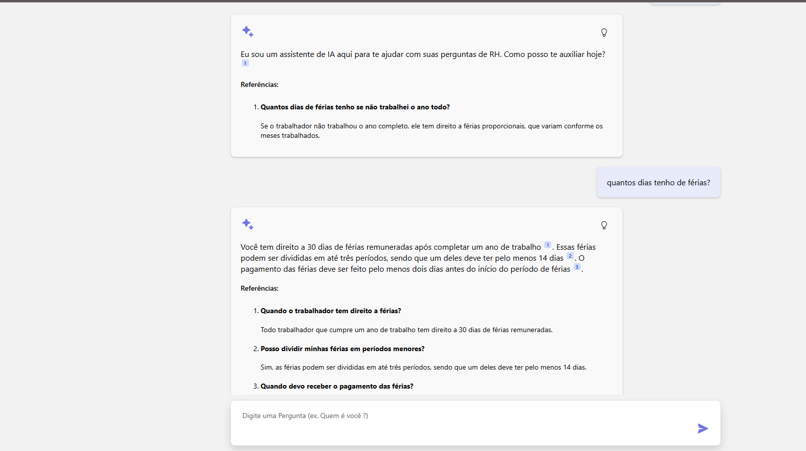

# RAG com Postgres

Projeto de conclusão de curso de inteligência artificial Catolica SC.

Este projeto baseado no modelo fornecido da microsoft, foi utilizado para estudos de criação de aplicações em nuvem, utilizando inteligência artificial generativa.
O frontend em React e FluentUI fornece uma interface de chat para que o backend em python, utilizando FastAPI, possa consultar uma base Postgres contendo informações em formato vetorial, para que a LLM do OpenAI possa retornar informações úteis a respeito de leis trabalhistas de férias.

Para fazer Deploy desse projeto utilize [Azure Developer CLI](https://learn.microsoft.com/azure/developer/azure-developer-cli/), assim serão criados os recursos: Azure Container Apps e Banco de Dados PostgreSQL

Para Recursos de LLM foi utilizado uma conta OpenAI.

# Métodos

* Busca Híbrida no PostgreSQL, utiliza [a extensão pgvector](https://github.com/pgvector/pgvector); para [busca textual](https://www.postgresql.org/docs/current/textsearch-intro.html), os resultados são combinados usando técnica RRF (Reciprocal Rank Fusion).

* A função da OpenAI é converter perguntas do usuário em query com as condições de filtro. Por exemplo "posso tirar férias" WHERE texto like "posso tirar%".

* A conversão de perguntas em vetores utiliza API OpenAI de embedding.

# Passo a passo

1. Usuário faz uma pergunta.
2. LLM rescreve a pergunta em um query para ser utilizada na busca em base de dados.
3. Applicação usar um embedding model para gerar um vector embedding ao rescrever a query.
4. A app busca na tabela do PostgreSQL usando full-text search e vector para encontrar as informações relevantes.
5. Aplicação envia de volta a pergunta inicial do usuário com a resposta gerada por LLM com as informações do banco de dados.

Quando clica na lâmpada aparece uma explicabilidade.

Para rescrever a query é utilizado [OpenAI function calling](https://platform.openai.com/docs/guides/function-calling). Onde podemos especificar as colunas da tabela que serão utilizadas para gerar a query.

 A resposta é parseada em [query_rewriter.py](/src/backend/fastapi_app/query_rewriter.py) para extrair o SQL e colunas, depois sao passados para  [postgres_searcher.py](/src/backend/fastapi_app/postgres_searcher.py) que faz a busca na base. A função `search_database` está em [query_rewriter.py](/src/backend/fastapi_app/query_rewriter.py), também utiliza exemplos em [query_fewshots.json](/src/backend/fastapi_app/prompts/query_fewshots.json).

Para fazer a chamada de função da LLM, é utilizado um modelo GPT 3.5 Turbo do OpenAI. Desenvolvimento local pode ser feito utilizando o Ollama - modelo llama3.1.

# Requisitos

* [Azure Developer CLI (azd)](https://aka.ms/install-azd)
* [Node.js 18+](https://nodejs.org/download/)
* [Python 3.9+](https://www.python.org/downloads/)
* [PostgreSQL 14+](https://www.postgresql.org/download/)
* [pgvector](https://github.com/pgvector/pgvector)
* [Docker Desktop](https://www.docker.com/products/docker-desktop/)
* [Git](https://git-scm.com/downloads)

# Referências

* Projeto Base no [GitHub](https://github.com/Azure-Samples/rag-postgres-openai-python/?tab=readme-ov-file#rag-on-postgresql)

* [RAGHack livestream: Building RAG with PostgreSQL](https://www.youtube.com/watch?v=Dk65oQjYAfo)

* [RAG chat with Azure AI Search + Python](https://github.com/Azure-Samples/azure-search-openai-demo/)

* [Develop Python apps that use Azure AI services](https://learn.microsoft.com/azure/developer/python/azure-ai-for-python-developers)
